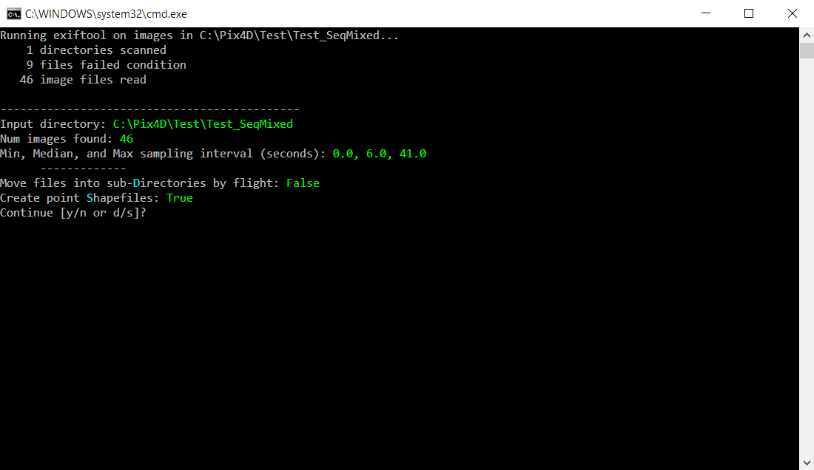
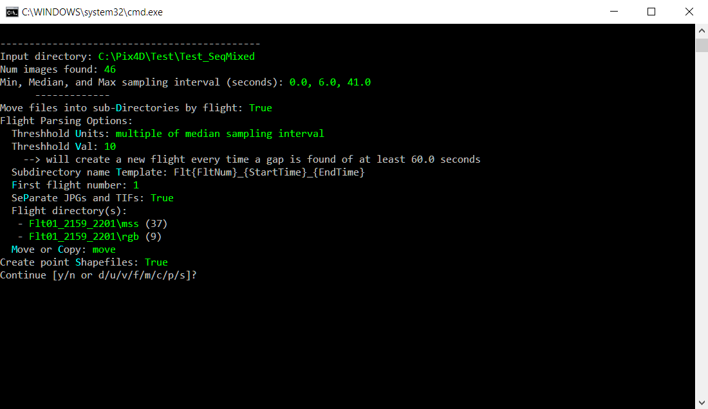
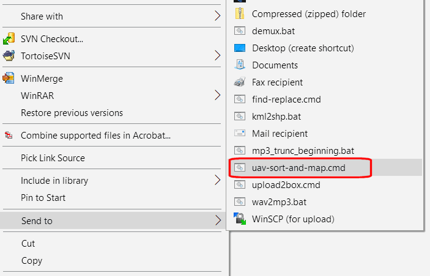

# Parse Aerial Photos from Drones

## Intro

When using drones for mapping, at the end of the day you often wind up with a folder containing hundreds or even thousands of images from multiple flights. At this point in the workflow, you have to determine whether there were any gaps (or duplication) in coverage, decide whether or not you want to discard the data from any flights, and whether to process (stitch) the images as a whole or flight-by-flight (which depends on a number of factors, including the number of images, amount of overlap, time between flights, etc.). To help you make these decisions, you may have kept notes or a log throughout the day about specific flights (e.g., didn't complete the mission, cloud shadow came across, camera malfunctioned, etc.), that you now need to connect the files.

This Python script automates three processes that are often the next part of the workflow, but extremely tedious to do manually:

1. Identify which images were taken from differet flights based on the timestamp saved in the EXIF image header
1. Create subfolders for each flight and move the approprite images to them
1. Create a point Shapefile for the images taken on each flight that you can pull up in a GIS program

Folder names for the flights conform to the recommended directory structure described at <http://igis.ucanr.edu/Tech_Notes/Drone_Data/>

## Usage

The script provides the user options to

- create subdirectories for each flight
- move or copy files into subdirectories for each flight, with an additional option to separate JPGs and TIFs into separate directories (for cameras like the Parrot Sequoia)
- define the time interval between flights
- customize the template used to name flight subdirectories
- specify the first flight number
- create point shapefiles

The script can be run from the command line, Windows Explorer's 'Send To', or any other method for launching a Python script (see also [Launching the Script](#launching-the-script) below). A text based menu system allows you to change options by entering one of the letters highlighted in blue. 



### Flight Parsing

The script gueses which images were taken on the same flight by looking at the image timestamps (images on drone mapping missions are usually taken at a consistent intervals). You can specify the minimum gap that signifies a different flight either as a multiple of the median sampling interval, or an absolute period of time (in seconds). The script reports the median sampling interval for your reference.



## Compatibility and Testing

The script utilizes the *DateTimeOriginal*, *GPSLatitude*, and *GPSLongitude* tags in the header of an image file (usually jpg or tif). It should therefore work with any camera or sensor that saves these tags as part of the file. 

The script has been tested with images taken from a ZenMuse X3, ZenMuse X5, ZenMuse XT, Parrot Sequoia (both RGB & MSS), and GoPro Hero4 camera (geostamped after the flight using the drone's telemetry log, see <http://igis.ucanr.edu/Tech_Notes/Geotagging_Telemetry/>). If it does not work for you, your camera might use different header tags. If you send us a sample photo we'll try to add the correct tags.

The script has only been tested on Windows. All of the dependencies (including Exiftool) are cross-platform, so it should work on MacOS also, but may need some modification. The script was written for Python 2.7 and has not been tested with Python 3.

## Setup

The script is written for Python 2.7 and requires the following Python modules and third-party utilities: 

- colorama (Python module)
- ogr (Python module, part of gdal or osgeo)
- exiftool (command line tool)

### colorama

On a Windows machine, you may be able to install *colorama* by running:

```
cd C:\Python27\ArcGIS10.5\Scripts
pip.exe install colorama
```

### ogr

ogr is part of *GDAL* which is part of *osgeo*. The Python module is essentially a wrapper for the gdal library. See below for installation instructions.

 - <https://pythongisandstuff.wordpress.com/2016/04/13/installing-gdal-ogr-for-python-on-windows/>
 - <https://gis.stackexchange.com/questions/2276/installing-gdal-with-python-on-windows>
 - <https://sandbox.idre.ucla.edu/sandbox/tutorials/installing-gdal-for-windows>

Be warned installation may not be easy. If you don't know a lot about installing Python libraries and would prefer not to learn, consider getting someone to help you. After a lot of trial and error (mostly error), the instructions in the first linked worked for me. Good luck!

### exiftool

This script also requires a command line utility called exiftool.

1. Download from <http://www.sno.phy.queensu.ca/~phil/exiftool/>
1. Extract the *exiftool(-k).exe* file
1. Rename *exiftool(-k).exe* to *exiftool.exe*
1. Move *exiftool.exe* to a directory on the system PATH (like c:\windows)

## Launching the Script

### Command Line

From the command line, you can run the script like any other Python script. The script requires one argument, the name of a directory containing images. If the directory name contain spaces, be sure to enclose it in double-quotes.

```
c:\> python parse-uav-imgs.py "C:\Drone Projects\Granger Ranch\2017-06-19 X5images"
```

### Launching from the Windows 'Send To' menu 

An easier way to launch the script is from the 'Send To' menu that appears when you right-click on a folder in the Windows Explorer. To do this, create a file in Notepad with the following three lines (change the last line to the actual directory where you save the py file):

```
@echo off
cls
python C:\SomeDir\parse-uav-imgs.py %1
```

Save the file in your system 'Send To' folder. Call it something like *uav-sort-and-map.cmd*. If you don't know where the 'Send To' folder is, type `shell:sendto` in the address bar of Windows Explorer. You should now see the cmd file in the 'Send To' pop-up menu when you right-click on a folder in Windows Explorer.



## License

UAV-Image-Sort-And-Map is licensed under BSD 3-Clause License, see the LICENSE file for more details.

